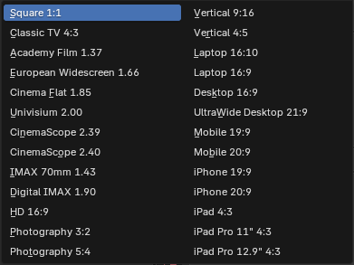

# Aspect Ratio – Blender Add-on

A Blender add-on to quickly apply common film, cinema, photography, desktop, and mobile aspect ratios.

## Installation

1. Download `film_aspect_ratio.py`
2. Open **Blender → Edit → Preferences → Add-ons**
3. Click **Install**, select the `.py` file
4. Enable **Film Aspect Ratio**

## Usage

1. Go to **Output Properties**
2. Select an aspect ratio
3. Click **Apply**

## Aspect Ratios

| Category | Name | Resolution |
|--------|------|------------|
| Square | Square 1:1 | 1080 × 1080 |
| Classic TV | Classic 4:3 | 1440 × 1080 |
| Film | Academy 1.37 | 1480 × 1080 |
| Cinema | European 1.66 | 1792 × 1080 |
| Cinema | Flat 1.85 | 1920 × 1038 |
| Cinema | Univisium 2.00 | 1920 × 960 |
| Scope | CinemaScope 2.39 | 1920 × 804 |
| Scope | CinemaScope 2.40 | 1920 × 800 |
| IMAX | IMAX 70mm 1.43 | 2048 × 1432 |
| IMAX | Digital IMAX 1.90 | 1920 × 1010 |
| HD | 16:9 | 1920 × 1080 |
| Photo | 3:2 | 1620 × 1080 |
| Photo | 5:4 | 1350 × 1080 |
| Vertical | 9:16 | 1080 × 1920 |
| Vertical | 4:5 | 1080 × 1350 |
| Laptop | 16:10 | 1920 × 1200 |
| Desktop | 16:9 | 2560 × 1440 |
| Desktop | 21:9 | 3440 × 1440 |
| Mobile | 19:9 | 1080 × 2280 |
| Mobile | 20:9 | 1080 × 2400 |
| Apple | iPhone 19:9 | 1125 × 2436 |
| Apple | iPhone 20:9 | 1170 × 2532 |
| Apple | iPad 4:3 | 2048 × 1536 |
| Apple | iPad Pro 11" | 2388 × 1668 |
| Apple | iPad Pro 12.9" | 2732 × 2048 |

## Screenshots

